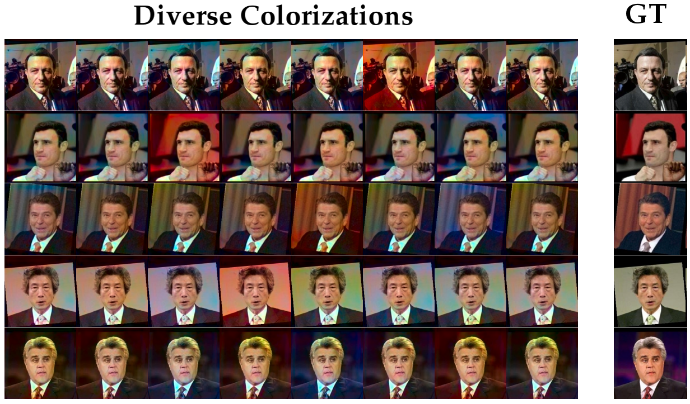

# pytorch_divcolor

PyTorch implementation of Diverse Colorization -- Deshpande et al. "[Learning Diverse Image Colorization](https://arxiv.org/abs/1612.01958)"                 

This code is tested for python-3.5.2 and torch-0.3.0. Install packages in requirements.txt

The Tensorflow implementation used in the paper is [divcolor](https://github.com/aditya12agd5/divcolor)


Fetch data by

```
bash get_data.sh
```

Execute main.py to first train vae+mdn and then, generate results for LFW

```
python main.py lfw
```

If you use this code, please cite
                                                                                                    
```
@inproceedings{DeshpandeLDColor17,                                                                  
  author = {Aditya Deshpande, Jiajun Lu, Mao-Chuang Yeh, Min Jin Chong and David Forsyth},          
  title = {Learning Diverse Image Colorization},                                                    
  booktitle={Computer Vision and Pattern Recognition},                                              
  url={https://arxiv.org/abs/1612.01958},                                                           
  year={2017}                                                                                       
} 
```

Some examples of diverse colorizations on LFW

<p align='center'>

</p>

